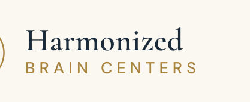
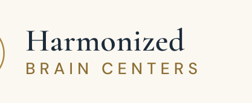
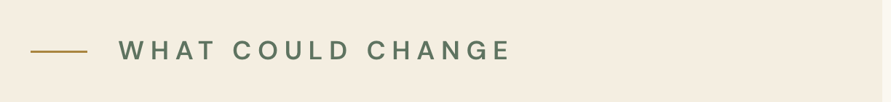
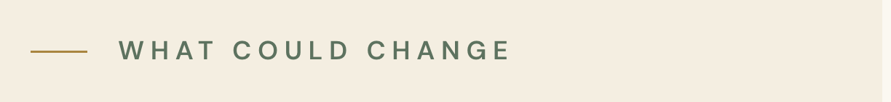

# Two colour decisions

**Status — settled.** Sage is **`#596e5b`**, applied. Gold is unchanged and
stays unchanged; neither gold option was taken, and this file is the record of
what was offered.

Sage landed in two steps. `#5a6f5c` went in first and cleared the eyebrows but
left the `.note-sage` panels at **4.4903** — under 4.5, not "4.5 rounded", and
this file's original phrasing ("4.49 … which rounds to 4.5") is what made that
look settled when it wasn't. `#596e5b` clears every sage pairing that ships.

Every number below is measured the same way the hero was: hide every glyph,
photograph the page, read the composited pixel under the text, compute the WCAG
ratio. The arithmetic and the browser agree to the second decimal on all of
them.

---

## 1. Gold on ivory — 3.24:1 (unchanged, left alone)

`--gold: #a9853f` on `--ivory: #fbf8f1`.

This is one decision covering the header wordmark, every testimonial theme
label, every team member role, every numbered step marker, the location card
city lines, the FAQ `+` marker and the audience labels — all 25 routes, every
width.

### Minimum darkening

Darkened along the colour's own ray in sRGB, which is the smallest move that
leaves the hue where it is.

| | Hex | rgb | vs ivory | vs ivory-2 | vs white |
| --- | --- | --- | --- | --- | --- |
| today | `#a9853f` | 169, 133, 63 | **3.24** | 2.97 | 3.43 |
| **minimum for ivory** | `#8c6e34` | 140, 110, 52 | **4.50** | 4.13 | 4.78 |
| minimum for every light backdrop | `#856831` | 133, 104, 49 | 4.92 | **4.52** | 5.22 |

`#8c6e34` is 82.8% of today's value. Nothing gold currently sits on ivory-2, so
`#8c6e34` clears everything that exists; `#856831` is the value that would also
survive somebody putting a gold label on an ivory-2 band later.

### The catch: this token is not only used on light

Gold is also text **on navy**, and darkening it makes those worse — including
the Trisha role line I fixed this session, which depends on gold reaching
4.69:1 on the deepest navy.

| | homepage step numerals | location step numerals | Trisha role line |
| --- | --- | --- | --- |
| today `#a9853f` | 4.20 | 4.20 | **4.69** |
| `#8c6e34` | **3.02** | **3.02** | **3.37** |
| `#856831` | **2.76** | **2.76** | **3.09** |

So there are really two options:

- **A — darken `--gold` globally.** One line. Fixes every gold-on-light pairing.
  Takes five gold-on-dark pairings from 4.20/4.69 down to ~3.0, and undoes the
  Trisha fix.
- **B — split the token.** Keep `--gold: #a9853f` for dark backgrounds, add a
  second token (`--gold-ink: #8c6e34` or similar) and use it in the ~12 rules
  that put gold on ivory or white. Fixes both directions. Costs a token and a
  rule about which to use where.

`--gold-soft` (`rgba(169,133,63,.35)`) is a border colour only and is unaffected
either way.

### Rendered — the header wordmark at 414px, 3×

| | |
| --- | --- |
| today, 3.24:1 — what ships |  |
| `#8c6e34`, 4.50:1 |  |
| `#856831`, 4.92:1 |  |

---

## 2. Sage on ivory-2 — was 4.43:1, now 4.70:1 (applied)

`--sage-deep: #5e7360` on `--ivory-2: #f4eee1`.

One decision covering every section eyebrow on the site, plus the inline links
in FAQ answers, breadcrumbs, the founder citation link and the sage note panels.

### Minimum darkening

| | Hex | rgb | vs ivory | vs ivory-2 | vs sage-soft | vs white |
| --- | --- | --- | --- | --- | --- | --- |
| was | `#5e7360` | 94, 115, 96 | 4.8324 | **4.4333** | **4.2337** | 5.1255 |
| minimum for ivory-2 | `#5d725f` | 93, 114, 95 | 4.9018 | **4.5015** | 4.2977 | 5.1990 |
| tried, left the panels short | `#5a6f5c` | 90, 111, 92 | 5.1252 | 4.7019 | **4.4903** | 5.4361 |
| **applied** | `#596e5b` | 89, 110, 91 | **5.2018** | **4.7721** | **4.5573** | **5.5173** |

Two things worth knowing:

- The darkest backdrop sage sits on is not ivory-2, it is `--sage-soft`
  (`#e6ebe2`), the fill of the `.note-sage` panels on 11 routes — and the
  `/contact` phone number sits inside one. It is the binding constraint, and
  the reason the first value was not enough: 4.2337 before, 4.4903 at
  `#5a6f5c`, **4.5573** at `#596e5b`.
- The change is 94.9% of the original — five units per channel at most. It is
  not visible side by side.
- `--sage-deep` is used as a *background* in exactly one place (`.loc-card .soon`
  badge, ivory text on sage-deep). Darkening it raises that pairing's contrast,
  so nothing breaks in the other direction. Unlike gold, this token has no
  conflict.

### Rendered — the "What could change" eyebrow at 414px, 3×

| | |
| --- | --- |
| before, 4.4333:1 |  |
| `#5d725f`, 4.5015:1 |  |
| **`#5a6f5c`, 4.7019:1 — applied** |  |

---

## Where this landed

- **Gold — left alone.** Neither option applied. Every gold pairing still
  measures what it did: 3.24 on ivory, 3.43 on white, 4.20 on navy. 17 of the
  23 pairings still under 4.5 sitewide are this one decision.
- **Sage — `#596e5b` applied.** Measured on the page, worst case of each group:

  | | |
  | --- | --- |
  | `.note-sage` panels on `--sage-soft` | **4.5573** |
  | the `/contact` phone number inside one | **4.5573** |
  | section eyebrows on ivory-2 | **4.7721** |
  | eyebrows on ivory and white | **5.2018** |
  | `em.sage` inside an H2 | **4.7721** |

  Every sage pairing that ships clears 4.5. One does not and never ships: the
  "Embedded map — muted sage style" placeholder label at 3.53, which is behind
  `SHOW_DRAFT_CONTENT`.

Sitewide the sweep went 30 → 25 → **23** unique pairings under 4.5 across 34
routes × four widths: 17 gold, 5 draft-only decorations, and the draft-only map
label. Nothing that ships is under 4.5 except gold.
